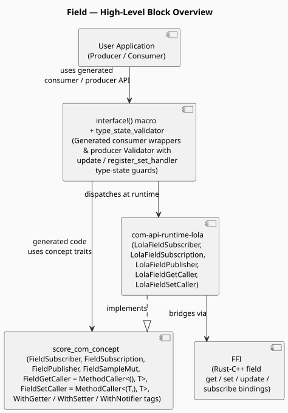
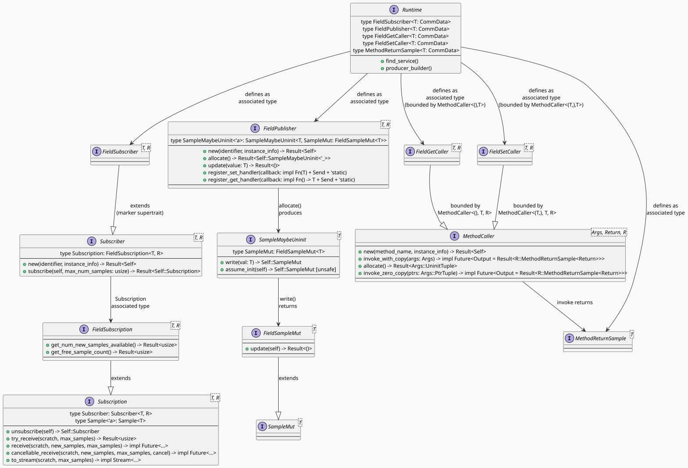

<!--
Copyright (c) 2026 Contributors to the Eclipse Foundation

See the NOTICE file(s) distributed with this work for additional
information regarding copyright ownership.

This program and the accompanying materials are made available under the
terms of the Apache License Version 2.0 which is available at
https://www.apache.org/licenses/LICENSE-2.0

SPDX-License-Identifier: Apache-2.0
-->
# COM API-Field Design

This document describes the design of the **field** APIs and usage of it.

## Contents

- [Overview](#overview)
- [Architecture](#architecture)
- [Core Trait Design](#core-trait-design)
  - [Runtime-Implemented Traits](#runtime-implemented-traits)
  - [Zero-Copy Publish Traits](#zero-copy-publish-traits)
  - [Base Subscription Traits](#base-subscription-traits)
- [Capability Tags](#capability-tags)
- [Get and Set Call Paths](#get-and-set-call-paths)
- [Interface Macro Integration](#interface-macro-integration)
- [Type-State Validator](#type-state-validator)
- [Producer Side API Usage](#producer-side-api-usage)
- [Consumer Side API Usage](#consumer-side-api-usage)
- [TODOs and Improvements](#todos-and-improvements)

---

## Overview

Rust Communication library provides the Field based communication pattern (mostly with alignment of C++ APIs). A field is a named, typed value that lives on a service provider and can be read, written, and subscribed to by consumers. The following are the major points of the design:

- A field combines three orthogonal capabilities, each activated by a tag in the `interface!` macro: **`WithGetter`** (async get), **`WithSetter`** (async set), and **`WithNotifier`** (subscribe to value-change notifications like Event).
- Field get and set on the consumer side are modelled as `MethodCaller`-based callers, reusing the full Method infrastructure (async futures, `MethodReturnSample<T>`, copy path) without a separate field-specific method design.
- Field publish on the producer side uses a dedicated `FieldPublisher` trait that provides `update()` (copy path) and `allocate()` + `FieldSampleMut::update()` (zero-copy path).
- Handler registration on the producer side is enforced at compile time via the type-state validator: `register_set_handler_{name}` must be called for every `WithSetter` field, `register_get_handler_{name}` must be called for every `WithGetter` field, and the field's initial value must be set via `update_{name}()` for every field, all before `offer()` becomes available. Bypassing the validator and calling `offer()` directly will panic at runtime.

Fields are defined as part of an interface via the `interface!` macro alongside events and methods:

```rust
interface!(
    interface VehicleField {
        Id = "VehicleFieldInterface",
        left_tire: Field<Tire, WithGetter + WithSetter + WithNotifier>,
        exhaust:   Field<Exhaust, WithGetter + WithSetter + WithNotifier>,
    }
);
```

The macro uses `name: Field<T, Tags>` syntax. At least one capability tag is required; `Field<T>` without tags is a compile error.

---

## Architecture

The field feature follows the same layered architecture as the rest of the COM API.



> Source: [field_overview](field_overview.svg)

| Layer | Role |
|-------|------|
| **Application** | User code calls `consumer.get_left_tire().await`, `consumer.set_left_tire(val).await`, subscribes via `consumer.left_tire.subscribe(n)`, and on the producer side calls `producer.init().update_left_tire(...).register_set_handler_left_tire(fn).offer()` |
| **Abstraction** | Platform-independent field traits in `score_com_concept`, `interface!` macro generates typed wrappers, `type_state_validator` enforces compile-time correctness |
| **Runtime** | Concrete `LolaFieldSubscriber` / `LolaFieldSubscription` / `LolaFieldPublisher` / `LolaFieldGetCaller` / `LolaFieldSetCaller` in `com-api-runtime-lola` |
| **FFI** | Rust–C++ bindings bridging field get/set dispatch, handler registration, and subscribe/notify to the underlying middleware |

---

## Core Trait Design

The full trait diagram is shown below. Source: [field_trait_diagram](field_trait_diagram.svg).




### Runtime-Implemented Traits

These traits must be implemented by every runtime (e.g. `com-api-runtime-lola`).

#### `FieldSubscriber<T, R>`

Marker supertrait of `Subscriber<T, R>`. It adds the constraint that the `Subscription` associated type must be a `FieldSubscription<T, R>`. All concrete subscription APIs (`new`, `subscribe`) are inherited from `Subscriber<T, R>`.

```rust
pub trait FieldSubscriber<T: CommData + Debug, R: Runtime + ?Sized>:
    concept::Subscriber<T, R, Subscription: FieldSubscription<T, R>>
{
}
```

The `interface!` macro generates a `{name}: R::FieldSubscriber<T>` struct field on the consumer for every `WithNotifier` field. The consumer calls `.subscribe(max_num_samples)` on it to receive field-value-change notifications.

#### `FieldSubscription<T, R>`

Extends `Subscription<T, R>` with two additional query methods for buffer introspection.

```rust
pub trait FieldSubscription<T: CommData + Debug, R: Runtime + ?Sized>:
    concept::Subscription<T, R>
{
    fn get_num_new_samples_available(&self) -> Result<usize>;
    fn get_free_sample_count(&self) -> Result<usize>;
}
```

`get_num_new_samples_available()` reports how many new samples `try_receive` would deliver. `get_free_sample_count()` reports how many more samples can be buffered before the subscription count overflows.

The base `Subscription<T, R>` already provides `try_receive`, `receive`, `cancellable_receive`, and `to_stream`.

#### `FieldPublisher<T, R>`

Producer-side field owner. Provides both the copy publish path and the zero-copy publish path, plus set/get handler registration.

```rust
pub trait FieldPublisher<T: CommData + Debug, R: Runtime + ?Sized> {
    type SampleMaybeUninit<'a>: SampleMaybeUninit<T, SampleMut: FieldSampleMut<T>> + 'a
    where
        Self: 'a;

    fn new(identifier: &'static str, instance_info: R::ProviderInfo) -> Result<Self>
    where
        Self: Sized;

    fn allocate(&self) -> Result<Self::SampleMaybeUninit<'_>>;

    fn update(&self, value: T) -> Result<()>;

    fn register_set_handler(&self, callback: impl Fn(T) + Send + 'static);

    fn register_get_handler(&self, callback: impl Fn() -> T + Send + 'static);
}
```

`update()` is the copy-path publish. For zero-copy writes, use `allocate()` to get an uninitialised slot and then call `write()` and then `update()`.

`register_set_handler` is called by the middleware whenever a consumer calls `set_{name}()`. It is required in the producer `init()` chain and tracked by the type-state validator (see [Type-State Validator](#type-state-validator)).

`register_get_handler` is called by the middleware whenever a consumer calls `get_{name}()`. It is also required in the producer `init()` chain and tracked by the type-state validator (see [Type-State Validator](#type-state-validator)).

#### `FieldGetCaller<T, R>` and `FieldSetCaller<T, R>`

These are `Runtime` associated types bounded by `MethodCaller`:

```rust
type FieldGetCaller<T: CommData + Debug>: MethodCaller<(), T, Self>;
type FieldSetCaller<T: CommData + Debug>: MethodCaller<(T,), T, Self>;
```

They are distinct associated types (not aliases) so runtimes can route to FFI-level getter/setter endpoints. Both reuse the full `MethodCaller` call infrastructure: async futures.

The `interface!` macro generates on the consumer:
- `{name}_get: R::FieldGetCaller<T>` + an async `get_{name}()` convenience wrapper for `WithGetter` fields.
- `{name}_set: R::FieldSetCaller<T>` + an async `set_{name}(val)` convenience wrapper for `WithSetter` fields.

### Zero-Copy Publish Traits

These traits form the zero-copy field publish pipeline on the producer side.

#### `FieldSampleMut<T>`

Extends `SampleMut<T>` (which provides `DerefMut<Target = T>`) :

```rust
pub trait FieldSampleMut<T>: concept::SampleMut<T>
where
    T: CommData + Debug,
{
    fn update(self) -> Result<()>;
}
```

`update()` consumes the sample and commits the written value to the field. It mirrors `EventSampleMut<T>::send()` in the event design.

#### `SampleMaybeUninit<T>`

A single uninitialised field slot. The producer writes a value into it, obtaining a `FieldSampleMut` that can be committed via `update()`.

```rust
pub trait SampleMaybeUninit<T> {
    type SampleMut: FieldSampleMut<T>;

    fn write(self, val: T) -> Self::SampleMut;

    /// # Safety
    /// The caller must ensure the memory has been properly initialized.
    unsafe fn assume_init(self) -> Self::SampleMut;
}
```
---

## Capability Tags

Each field must declare at least one capability tag. Tags are combined with `+`:

```rust
left_tire: Field<Tire, WithGetter + WithSetter + WithNotifier>,
exhaust:   Field<Exhaust, WithGetter>,
```

| Tag | Consumer-side generated code | Producer-side impact |
|-----|------------------------------|----------------------|
| `WithGetter` | `{name}_get: R::FieldGetCaller<T>` + `get_{name}() -> impl Future<...>` | `register_get_handler_{name}()` **required** in `init()` chain (type-state guarded: `HandlerNotSet` - `HandlerSet`) |
| `WithSetter` | `{name}_set: R::FieldSetCaller<T>` + `set_{name}(val) -> impl Future<...>` | `register_set_handler_{name}()` **required** in `init()` chain (type-state guarded: `HandlerNotSet` - `HandlerSet`) |
| `WithNotifier` | `{name}: R::FieldSubscriber<T>` (subscribe via `.subscribe(n)`) | Field value changes via `update()` notify all active subscribers |

Any combination and any ordering of tags is supported.

---

## Get and Set Call Paths

Both get and set reuse the `MethodCaller` copy path. There is no zero-copy path for get/set on the consumer side (only the producer publish path has zero-copy via `allocate()`).

**Get path** - read the current field value from the producer:

```rust
// get_{name}() calls MethodCaller::invoke_with_copy(&self.{name}_get, ())
match consumer.get_left_tire().await {
    Ok(sample) => {
        let tire: &Tire = &*sample; // Deref to access Tire
        println!("Current pressure: {:?}", tire);
    }
    Err(e) => eprintln!("Error: {:?}", e),
}
```

**Set path** - write a new value to the field on the producer, returns the confirmed value:

```rust
// set_{name}(val) calls MethodCaller::invoke_with_copy(&self.{name}_set, (val,))
match consumer.set_left_tire(Tire { pressure: 35.0 }).await {
    Ok(sample) => println!("Confirmed pressure: {:?}", *sample),
    Err(e) => eprintln!("Error: {:?}", e),
}
```

The compiler selects the correct `MethodCaller` specialisation from the `Runtime` associated types (`FieldGetCaller` vs `FieldSetCaller`) - no runtime branching.

---

## Interface Macro Integration

The `interface!` macro accepts fields using `name: Field<T, Tags>` syntax:

```rust
interface!(
    interface VehicleField {
        Id = "VehicleFieldInterface",
        left_tire: Field<Tire, WithGetter + WithSetter + WithNotifier>,
        exhaust:   Field<Exhaust, WithGetter + WithSetter + WithNotifier>,
    }
);
```

For each field the macro generates:

**On `VehicleFieldConsumer<R>`**:
- `left_tire: R::FieldSubscriber<Tire>` - subscribe to change notifications (`WithNotifier`)
- `left_tire_get: R::FieldGetCaller<Tire>` - underlying get caller (`WithGetter`)
- `left_tire_set: R::FieldSetCaller<Tire>` - underlying set caller (`WithSetter`)
- `get_left_tire() -> impl Future<...>` - async get convenience wrapper (`WithGetter`)
- `set_left_tire(val) -> impl Future<...>` - async set convenience wrapper (`WithSetter`)

**On `VehicleFieldValidator<R, ...>`** (returned by `producer.init()`):
- `update_left_tire(value: T) -> Result<Self>` — sets the initial field value; advances the type-state from `Uninit` to `Init`. **Generated for every field.**
- `register_set_handler_left_tire(fn)` — registers the set callback; advances `HandlerNotSet` - `HandlerSet`. **Generated only for `WithSetter` fields.**
- `register_get_handler_left_tire(fn)` — registers the get callback; advances `HandlerNotSet` - `HandlerSet`. **Generated only for `WithGetter` fields.**

The `interface_producer_mixed!` macro emits `#[field_setter_list(left_tire, exhaust)]` and `#[field_getter_list(left_tire, exhaust)]` struct-level attributes on the producer struct so the `TypeStateValidator` proc-macro knows which steps to generate.

**On `VehicleFieldOfferedProducer<R>`**:
- `left_tire: R::FieldPublisher<Tire>` - live publisher used to call `update()` after the service is offered.

---

## Type-State Validator

The `type_state_validator` proc-macro generates a compile-time state machine on the producer initialisation path. It inspects the producer struct and the `#[field_setter_list(...)]` / `#[field_getter_list(...)]` attributes emitted by `interface_producer_mixed!` to know which fields have which capability tags. For each `FieldPublisher` field, up to three independent states are tracked:

- **Initial value** (`Si`): transitions from `Uninit` to `Init` when `update_{name}()` is called — **all fields, always**.
- **Set handler** (`Hj`): transitions from `HandlerNotSet` to `HandlerSet` when `register_set_handler_{name}()` is called — **`WithSetter` fields only**.
- **Get handler** (`Gk`): transitions from `HandlerNotSet` to `HandlerSet` when `register_get_handler_{name}()` is called — **`WithGetter` fields only**.

For methods, `Mp` tracks handler registration as before.

`offer()` is only available once all `Si = Init`, all `Hj = HandlerSet`, all `Gk = HandlerSet`, and all `Mp = HandlerSet`. Calling `offer()` before completing the chain is a compile error. A field with only `WithNotifier` (no getter, no setter) only requires `update_*` before `offer()`.

```rust
// Compile error: offer() not available until all update_* and handler steps are done
producer.init()
    .update_left_tire(initial_tire)?
    // missing: register_set_handler_left_tire  (WithSetter)
    // missing: register_get_handler_left_tire  (WithGetter)
    // missing: update_exhaust / register_set_handler_exhaust / register_get_handler_exhaust
    .offer()  // compile error
```

```rust
// Correct: all fields initialised and all tag-gated handlers registered
producer
    .init()
    .register_set_handler_left_tire(|val: Tire| {
        println!("Received tire set: {:?}", val);
    })
    .register_get_handler_left_tire(|| Tire { pressure: 32.0 })
    .register_set_handler_exhaust(|val: Exhaust| {
        let _ = val;
    })
    .register_get_handler_exhaust(|| Exhaust {})
    .update_left_tire(initial_tire_value)?
    .update_exhaust(initial_exhaust_value)?
    .offer()?;
```

Note: For event-only interfaces, `producer.offer()` can be called directly. For fields (and methods), `offer()` must be reached via the `producer.init()` chain, and calling `offer()` directly will panic at runtime.

---

## Producer Side API Usage

The following example is drawn from [`com-api-example/src/field_producer.rs`](../../example/com-api-example/src/field_producer.rs).

```rust
use score_com::{Builder, FieldPublisher, InstanceSpecifier, Interface, Producer, Runtime};
use com_api_gen::{Exhaust, Tire, VehicleFieldInterface};

fn create_producer_field<R: Runtime + 'static>(
    runtime: &R,
    service_id: InstanceSpecifier,
    initial_tire_value: Tire,
    initial_exhaust_value: Exhaust,
) -> <<VehicleFieldInterface as Interface>::Producer<R> as Producer<R>>::OfferedProducer
where
    <R as Runtime>::FieldPublisher<Tire>: Send + Sync,
    <R as Runtime>::FieldPublisher<Exhaust>: Send,
{
    let producer = runtime
        .producer_builder::<VehicleFieldInterface>(service_id)
        .build()
        .expect("Failed to build producer instance");

    producer
        .init()
        // Register set-handler callbacks - required before offer() for WithSetter fields
        .register_set_handler_left_tire(move |val: Tire| {
            println!("Received tire pressure update: {:?}", val);
        })
        .register_set_handler_exhaust(|val: Exhaust| {
            let _ = val;
        })
        // Register get-handler callbacks - required before offer() for WithGetter fields
        .register_get_handler_left_tire(|| Tire { pressure: 32.0 })
        .register_get_handler_exhaust(|| Exhaust {})
        // Set initial field values - required before offer() for all fields
        .update_left_tire(initial_tire_value)
        .expect("Failed to update left_tire field")
        .update_exhaust(initial_exhaust_value)
        .expect("Failed to update exhaust field")
        .offer()
        .expect("Failed to offer producer instance")
}
```

Key points:

- `producer.init()` returns the generated `Validator` type; each `register_set_handler_*`, `register_get_handler_*`, and `update_*` call advances the type-state.
- All required steps must complete before `offer()` is available. The order of calls is flexible.
- `register_set_handler_*` is only generated for `WithSetter` fields; `register_get_handler_*` is only generated for `WithGetter` fields. Fields with neither tag only require `update_*`.
- After `offer()`, the returned `OfferedProducer` holds the live `FieldPublisher` instances for ongoing `update()` calls.

To update a field at runtime after offering:

```rust
fn offered_producer_process<R: Runtime>(offered_producer: VehicleFieldOfferedProducer<R>) {
    // Copy-path update - value is copied into the shared-memory slot by the FFI layer
    offered_producer
        .left_tire
        .update(Tire { pressure: 32.0 })
        .expect("Failed to update left_tire field");

    // Zero-copy update - allocate a slot, write directly, then commit
    let slot = offered_producer.left_tire.allocate()
        .expect("Allocation failed");
    let sample_mut = slot.write(Tire { pressure: 32.0 });
    sample_mut.update().expect("Failed to commit zero-copy update");
}
```

---

## Consumer Side API Usage

The following examples are drawn from [`com-api-example/src/field_consumer.rs`](../../example/com-api-example/src/field_consumer.rs).

### Async get - read the current field value

```rust
match consumer.get_left_tire().await {
    Ok(result) => println!("Current tire pressure: {:?}", *result), // Deref to access Tire
    Err(e) => eprintln!("Failed to get tire pressure: {:?}", e),
}
```

### Async set - write a new value; receive confirmed value back

```rust
match consumer.set_left_tire(Tire { pressure: 35.0 }).await {
    Ok(result) => println!("Confirmed tire pressure after set: {:?}", *result),
    Err(e) => eprintln!("Failed to set tire pressure: {:?}", e),
}
```

### Subscribe to field-value-change notifications (`WithNotifier`)

```rust
// subscribe() takes left_tire by value - get/set callers are separate struct fields
// so they remain usable after this move
let subscription = consumer
    .left_tire
    .subscribe(3)
    .expect("Failed to subscribe to field");

// Poll for updates (non-blocking)
let mut sample_buf = SampleContainer::new(3);
match subscription.try_receive(&mut sample_buf, 1) {
    Ok(n) if n > 0 => {
        while let Some(sample) = sample_buf.pop_front() {
            println!("Updated tire pressure: {:?}", *sample);
        }
    }
    _ => println!("No new tire pressure updates available"),
}

```

Note: `subscribe()` consumes the `FieldSubscriber` struct field by value. The `{name}_get` and `{name}_set` callers are separate struct fields on the consumer, so they are not consumed and remain usable in the same async context.

---

## TODOs and Improvements

### LoLa runtime FFI implementation for fields

All `LolaFieldSubscriber`, `LolaFieldSubscription`, `LolaFieldPublisher`, `LolaFieldGetCaller`, and `LolaFieldSetCaller` methods in `com-api-runtime-lola` are currently `todo!()` placeholders. The FFI bindings to the underlying C++ middleware for field subscribe/notify, get, set, and update are not yet implemented. This blocks all end-to-end field tests.

### Zero-copy set path on the consumer side

The current consumer set path (`set_{name}()`) uses `MethodCaller::invoke_with_copy`, which copies the argument value. If the runtime adds support for `invoke_zero_copy` on `FieldSetCaller`, the consumer could pre-allocate a slot via `{name}_set.allocate()` and pass a `ZeroCopyArgs`-wrapped pointer - identical to the method zero-copy path.
