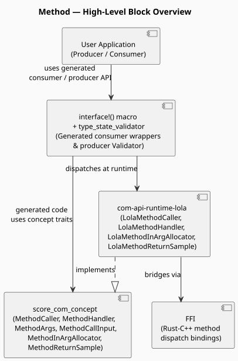
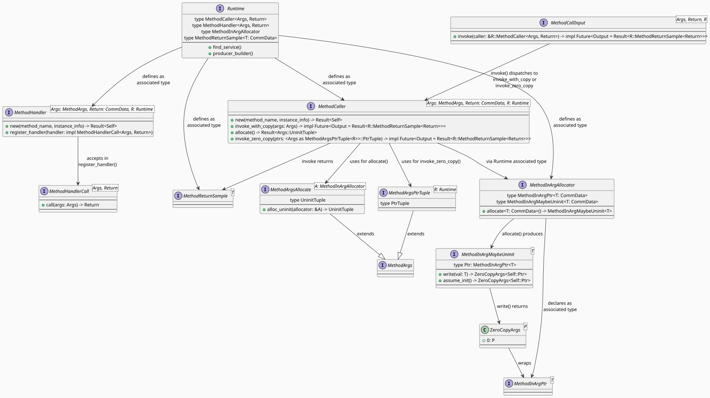

<!--
Copyright (c) 2026 Contributors to the Eclipse Foundation

See the NOTICE file(s) distributed with this work for additional
information regarding copyright ownership.

This program and the accompanying materials are made available under the
terms of the Apache License Version 2.0 which is available at
https://www.apache.org/licenses/LICENSE-2.0

SPDX-License-Identifier: Apache-2.0
-->
# COM API-Method Design

This document describes the design of the **method** APIs and usage of it.

## Contents

- [Overview](#overview)
- [Architecture](#architecture)
- [Core Trait Design](#core-trait-design)
  - [Runtime-Implemented Traits](#runtime-implemented-traits)
  - [Allocation Traits](#allocation-traits)
  - [Macro-Internal Supporting Traits](#macro-internal-supporting-traits)
- [Argument Arity Design](#argument-arity-design)
- [Copy vs Zero-Copy Call Paths](#copy-vs-zero-copy-call-paths)
- [Interface Macro Integration](#interface-macro-integration)
- [Type-State Validator](#type-state-validator)
- [Producer Side API Usage](#producer-side-api-usage)
- [Consumer Side API Usage](#consumer-side-api-usage)
- [TODOs and Improvements](#todos-and-improvements)

---

## Overview

Rust Communication library provides the Method based communication pattern (mostly with alignment of c++ APIs), followings are major points
of the design-
- Method calls are always async and every generated wrapper returns `impl Future` and must be `.await`ed.
- Arguments can be passed by value (copy path) or via pre-allocated pointers (zero-copy path) using the same call site and the compiler selects the correct dispatch based on argument type.
- Return values are wrapped in `R::MethodReturnSample<T>`, which provides `Deref<Target = T>` access, allowing the runtime to back the return with shared memory without an extra copy.
- Handler registration on the producer side is enforced at compile time via the type-state validator, `offer()` is only callable after all method handlers are registered. Bypassing the validator and calling `offer()` directly will panic at runtime.

Methods are defined as part of an interface via the `interface!` macro alongside events and fields:

```rust
interface!(
    interface VehicleMethods {
        Id = "VehicleMethodsInterface",
        update_tire_pressure(Tire) -> (),
        update_front_tires_pressure(Tire, Tire) -> (),
        get_tire_pressure() -> Tire,
    }
);
```

The macro uses `fn`-like syntax: `method_name(ArgType0, ArgType1, ...) -> ReturnType`. For void return, `-> ()` is required.

---

## Architecture

The method feature follows the same layered architecture as the rest of the COM API.



> Source: [method_overview](method_overview.svg)

| Layer | Role |
|-------|------|
| **Application** | User code calls `consumer.method(args).await` and registers `producer.init().register_handler(fn).offer()` |
| **Abstraction** | Platform-independent method traits in `score_com_concept`,  `interface!` macro generates typed wrappers, `type_state_validator` enforces compile-time correctness |
| **Runtime** | Concrete `LolaMethodCaller` / `LolaMethodHandler` in `com-api-runtime-lola` that translate trait calls to FFI operations |
| **FFI** | Rust–C++ bindings bridging method dispatch and handler registration to the underlying middleware |

---

## Core Trait Design

The full trait diagram is shown below. Source: [method_trait_diagram](method_trait_diagram.svg).



Traits split into three groups based on who implements them.

### Runtime-Implemented Traits

These traits must be implemented by every runtime (e.g. `com-api-runtime-lola`).

#### `MethodHandler<Args, Return, R>`

Producer-side handler registration. The runtime is responsible for setting up the dispatch mechanism (e.g. thread pool, async executor) that receives incoming calls and routes them to the registered handler.

```rust
pub trait MethodHandler<Args: MethodArgs, Return: CommData, R: Runtime + ?Sized> {
    fn new(method_name: &str, instance_info: R::ProviderInfo) -> Result<Self>
    where
        Self: Sized;

    fn register_handler<F>(&self, handler: F)
    where
        F: MethodHandlerCall<Args, Return>;
}
```

The `register_handler` call accepts any value that satisfies `MethodHandlerCall<Args, Return>` and this is automatically satisfied by closures and function pointers with the matching signature.

Note: The runtime may dispatch incoming calls concurrently to the same handler. Handlers must synchronize any access to shared mutable state internally.

#### `MethodCaller<Args, Return, R>`

Consumer-side method invocation. Provides both the copy path and the zero-copy path, plus argument allocation.

```rust
pub trait MethodCaller<Args: MethodArgs, Return: CommData, R: Runtime + ?Sized> {
    fn new(method_name: &str, instance_info: R::ConsumerInfo) -> Result<Self>
    where
        Self: Sized;

    fn invoke_with_copy<'a>(&'a self, args: Args)
        -> impl Future<Output = Result<R::MethodReturnSample<Return>>> + 'a;

    fn allocate(&self)
        -> Result<<Args as MethodArgsAllocate<R::MethodInArgAllocator>>::UninitTuple>
    where
        Args: MethodArgsAllocate<R::MethodInArgAllocator>;

    fn invoke_zero_copy<'a>(&'a self, ptrs: <Args as MethodArgsPtrTuple<R>>::PtrTuple)
        -> impl Future<Output = Result<R::MethodReturnSample<Return>>> + 'a
    where
        Args: MethodArgsPtrTuple<R>;
}
```

`invoke_with_copy` and `invoke_zero_copy` are not intended to be called by application code directly. The `interface!` macro generates a single wrapper per method on the consumer that accepts both forms transparently via `MethodCallInput` (see [Copy vs Zero-Copy Call Paths](#copy-vs-zero-copy-call-paths)).

### Allocation Traits

These traits form the zero-copy argument allocation pipeline.

#### `MethodReturnSample<T>`

Trait for the return value of a method call on the consumer side. Mirrors `Sample<T>` in the event design, each runtime implements this trait on its own concrete type, which can provide zero-copy access to the return data by backing it with shared memory.

```rust
pub trait MethodReturnSample<T>: Deref<Target = T> {}
```

The `Runtime` trait declares it as an associated type bounded by this trait:

```rust
type MethodReturnSample<T: CommData>: MethodReturnSample<T>;
```

Concrete implementations:
- `LolaMethodReturnSample<T>` - in `com-api-runtime-lola`
- `MockMethodReturnSample<T>` - in `com-api-runtime-mock`

The consumer dereferences the sample to access the return value:

```rust
let sample = consumer.get_tire_pressure().await?;
let pressure: &Tire = &*sample; // Deref<Target = Tire>
```

#### `MethodInArgAllocator`

Runtime-specific allocator for method input arguments. An instance lives on the `MethodCaller` and hands out uninitialised slots. It also declares the runtime's concrete pointer type (`MethodInArgPtr<T>`) as an associated type, so both `write()` and `MethodArgsPtrTuple<R>` resolve to the same concrete type.

```rust
pub trait MethodInArgAllocator {
    /// The runtime-specific concrete pointer type produced after initialisation.
    type MethodInArgPtr<T: CommData>: MethodInArgPtr<T>;

    /// Equality constraint ensures write() returns ZeroCopyArgs<Self::MethodInArgPtr<T>>.
    type MethodInArgMaybeUninit<T: CommData>: MethodInArgMaybeUninit<T, Ptr = Self::MethodInArgPtr<T>>;

    fn allocate<T: CommData>(&self) -> Self::MethodInArgMaybeUninit<T>;
}
```

#### `MethodInArgMaybeUninit<T>`

A single uninitialised argument slot. The caller writes a value into it, obtaining a `ZeroCopyArgs<Self::Ptr>` that can be passed to the method call. Mirrors `SampleMaybeUninit<T>` in the event design.

```rust
pub trait MethodInArgMaybeUninit<T> {
    /// Runtime-specific concrete pointer type
    type Ptr: MethodInArgPtr<T>;

    fn write(self, val: T) -> ZeroCopyArgs<Self::Ptr>;

    /// # Safety
    /// The caller must ensure the memory has been properly initialized.
    unsafe fn assume_init(self) -> ZeroCopyArgs<Self::Ptr>;
}
```

#### `MethodInArgPtr<T>`

Trait for a fully-initialised, pre-allocated method argument pointer. Mirrors `SampleMut<T>` in the event design, each runtime implements this on its own concrete type (e.g. `LolaMethodInArgPtr<T>`) which will store an FFI slot pointer and run RAII cleanup on `Drop` once shared-memory pointer layout is added (issue #781).

```rust
pub trait MethodInArgPtr<T> {}
```

Runtime concrete types:
- `LolaMethodInArgPtr<T>` - in `com-api-runtime-lola` (placeholder, `Drop` stub ready for issue #781)
- `MockMethodInArgPtr<T>` - in `com-api-runtime-mock`

#### `ZeroCopyArgs<P>`

Newtype wrapper returned by `MethodInArgMaybeUninit::write()`. Passing a tuple of `ZeroCopyArgs<P>` to a consumer method selects the zero-copy call path. `P` is the runtime-specific type implementing `MethodInArgPtr<T>`.

```rust
pub struct ZeroCopyArgs<P>(pub P);
```

### Macro-Internal Supporting Traits

These traits are not implemented by runtimes. Blanket implementations are provided in `score_com_concept` for all supported arities (currently 0-8) via the `impl_all_arities!` macro in `method_arities_macros.rs`.
**Note**: `impl_all_arities!` is an internal implementation detail invoked automatically by the framework. User should not invoke or reference this macro directly.

#### `MethodArgs`

Marker trait for method argument tuples. Requires `CommData` because the tuple of argument values is the thing being transmitted in the copy path.

```rust
pub trait MethodArgs: CommData {}
```

#### `MethodArgsPtrTuple<R>`

Maps an `Args` tuple to the matching `ZeroCopyArgs`-wrapped pointer tuple for a given runtime `R`. Separated from `MethodArgs` because pointer types are runtime-specific — they live in `R::MethodInArgAllocator::MethodInArgPtr<T>`.

```rust
pub trait MethodArgsPtrTuple<R: Runtime + ?Sized>: MethodArgs {
    type PtrTuple;
}
// e.g. for R = LolaRuntime:
// (Tire, Tire)::PtrTuple = (ZeroCopyArgs<LolaMethodInArgPtr<Tire>>, ZeroCopyArgs<LolaMethodInArgPtr<Tire>>)
```

#### `MethodArgsAllocate<A>`

Maps an `Args` tuple to the matching uninitialised argument tuple for a specific allocator `A`.

```rust
pub trait MethodArgsAllocate<A: MethodInArgAllocator>: MethodArgs {
    type UninitTuple;
    fn alloc_uninit(allocator: &A) -> Self::UninitTuple;
}
// e.g. (Tire, Tire)::UninitTuple = (A::MethodInArgMaybeUninit<Tire>, A::MethodInArgMaybeUninit<Tire>)
```

#### `MethodCallInput<Args, Return, R>`

Unified input type for the `interface!`-generated consumer method wrapper. Implemented for both `Args` (copy path) and `(ZeroCopyArgs<P1>, ...)` (zero-copy path). The compiler selects the correct impl from the type passed at the call site — no runtime branching.

```rust
pub trait MethodCallInput<Args: MethodArgs, Return: CommData, R: Runtime + ?Sized> {
    fn invoke<'a>(
        self,
        caller: &'a R::MethodCaller<Args, Return>,
    ) -> impl Future<Output = Result<R::MethodReturnSample<Return>>> + 'a;
}
```

This is what allows a single generated method on the consumer to accept both calling conventions:

```rust
consumer.update_tire_pressure(tire)        // copy path — Args impl
consumer.update_tire_pressure(tire_ptr)    // zero-copy path — ZeroCopyArgs PtrTuple impl
```

#### `MethodHandlerCall<Args, Return>`

Callable abstraction for handler functions. Any `Fn` closure or function pointer with the matching signature automatically satisfies this trait through blanket impls for all arities.

```rust
pub trait MethodHandlerCall<Args, Return>: Send + Sync + 'static {
    fn call(&self, args: Args) -> Return;
}
```

---

## Argument Arity Design

Rust does not support variadic functions. Methods need to accept 0 - 8 typed arguments. Rather than generating separate trait implementations for each arity, the design uses argument tuples and a single `impl_all_arities!` macro in `method_arities_macros.rs`.

The macro generates blanket implementations of the following traits for each arity (0-8):

| Trait | Why blanket |
|-------|-------------|
| `MethodArgs` | Marker — arg tuple is `CommData` if all elements are |
| `MethodArgsPtrTuple<R>` | `PtrTuple` construction per arity using `R::MethodInArgAllocator::MethodInArgPtr<T>` |
| `MethodArgsAllocate<A>` | `alloc_uninit` loops per arity |
| `MethodCallInput` | Zero-copy path dispatches per arity via `ZeroCopyArgs` tuples |
| `MethodHandlerCall` | Handler `call()` unpacks tuple per arity |
| `Reloc` | Arg tuple is relocatable if all elements are |
| `CommData` | Arg tuple is `CommData` if all elements are |

The result: adding a new runtime requires only implementing `MethodCaller` and `MethodHandler`. All arity-specific glue is already provided.

---

## Copy vs Zero-Copy Call Paths

Both paths invoke the same generated method wrapper on the consumer. The compiler chooses the implementation based on the argument type.

**Copy path**-pass arguments by value:

```rust
// Args = (Tire,)  -  MethodCallInput impl for (Tire,)  -  invoke_with_copy
let tire = Tire { pressure: 30.0 };
consumer.update_tire_pressure(tire).await?;
```

**Zero-copy path**-allocate, write, then call with pre-allocated pointers:

```rust
// Allocate uninit slots from the runtime's MethodInArgAllocator
let (uninit,) = consumer.update_tire_pressure.allocate()?;
// Write the value into the slot — returns ZeroCopyArgs<R::MethodInArgPtr<Tire>>
let tire_ptr = uninit.write(Tire { pressure: 35.0 });
// PtrTuple = (ZeroCopyArgs<R::MethodInArgPtr<Tire>>,) — MethodCallInput zero-copy impl — invoke_zero_copy
consumer.update_tire_pressure(tire_ptr).await?;
```

The zero-copy path avoids copying argument data when the runtime backs arguments with shared memory. When the `MethodInArgPtr<T>` layout is fully implemented (issue https://github.com/eclipse-score/communication/issues/781), the write step will place data directly in the shared-memory slot used by the FFI call.

---

## Interface Macro Integration

The `interface!` macro in `interface_macros.rs` accepts methods using fn-like syntax:

```rust
interface!(
    interface VehicleMethods {
        Id = "VehicleMethodsInterface",
        update_tire_pressure(Tire) -> (),
        get_tire_pressure() -> Tire,
        update_front_tires_pressure(Tire, Tire) -> (),
    }
);
```

For each method, the macro generates:

**On `VehicleMethodsConsumer<R>`**-a callable wrapper field. The field is a struct that:
- Implements `AsyncFn` semantics so `consumer.update_tire_pressure(arg).await` works
- Exposes `.allocate()` for the zero-copy path
- Holds a reference to the runtime's `R::MethodCaller<(Tire,), ()>` instance
- Calls through `MethodCallInput::invoke()` to dispatch to the correct `MethodCaller` method

**On `VehicleMethodsValidator<R, ...>`** (returned by `producer.init()`)- a `register_update_tire_pressure_handler(fn)` method that:
- Accepts any `F: MethodHandlerCall<(Tire,), ()>`-i.e. any matching closure or fn pointer
- Calls `MethodHandler::register_handler(handler)` on the runtime's handler instance
- Advances the type-state (see [Type-State Validator](#type-state-validator))

---

## Type-State Validator

The `type_state_validator` proc-macro in `score_com_macros` generates a compile-time state machine on the producer initialisation path. Each method handler registration is tracked as a generic type parameter that transitions from `HandlerNotSet` to `HandlerSet`.

`offer()` is only available once all parameters are in the `HandlerSet` state. Calling `offer()` before registering all handlers is a compile error.

```rust
// Compile error: offer() not available until all three handlers are registered
producer.init()
    .register_update_tire_pressure_handler(process_tire)
    // missing: register_get_tire_pressure_handler
    // missing: register_update_front_tires_pressure_handler
    .offer()  // compile error
```

```rust
// Correct: all handlers registered
producer
    .init()
    .register_update_tire_pressure_handler(process_tire)
    .register_get_tire_pressure_handler(|| Tire { pressure: 32.0 })
    .register_update_front_tires_pressure_handler(|t1, t2| { /* ... */ })
    .offer()?;
```

Note: For event-only interfaces, `producer.offer()` can be called directly. For methods and fields, `offer()` must be called via the type-state validator path using `producer.init()` and calling `offer()` directly will panic.

---

## Producer Side API Usage

The following example is drawn from [`com-api-example/src/method_producer.rs`](../../example/com-api-example/src/method_producer.rs).

```rust
use score_com::{Builder, InstanceSpecifier, Interface, Producer, Runtime};
use com_api_gen::{Tire, VehicleMethodsInterface};

fn create_producer<R: Runtime>(
    runtime: &R,
    service_id: InstanceSpecifier,
) -> <<VehicleMethodsInterface as Interface>::Producer<R> as Producer<R>>::OfferedProducer {
    let producer = runtime
        .producer_builder::<VehicleMethodsInterface>(service_id)
        .build()
        .expect("Failed to build producer");

    producer
        .init()
        // Register with a named function pointer
        .register_update_tire_pressure_handler(process_tire)
        // Register with a closure-zero-argument method returning a value
        .register_get_tire_pressure_handler(|| Tire { pressure: 32.0 })
        // Register with a closure-two-argument method
        .register_update_front_tires_pressure_handler(|t1: Tire, t2: Tire| {
            println!("Front tires: {:?}, {:?}", t1, t2);
        })
        .offer()
        .expect("Failed to offer producer")
}

fn process_tire(tire: Tire) {
    println!("Tire pressure: {:?}", tire);
}
```

Key points:

- `producer.init()` returns the generated `Validator` type; each `register_*` call advances the type-state.
- Handlers are registered before `offer()`, which is the only way to make the service discoverable.
- Handlers may be closures or function pointers-any type satisfying `MethodHandlerCall<Args, Return>`.
- The runtime may call handlers concurrently. Handlers must synchronise any shared mutable state internally.

---

## Consumer Side API Usage

The following examples are drawn from [`com-api-example/src/method_consumer.rs`](../../example/com-api-example/src/method_consumer.rs).

All method calls return `impl Future<Output = Result<R::MethodReturnSample<T>>>` and must be `.await`ed.
The returned sample implements `Deref<Target = T>`.

### Single-argument-copy path

```rust
let tire = Tire { pressure: 30.0 };
match consumer.update_tire_pressure(tire).await {
    Ok(_) => println!("Method called successfully"),
    Err(e) => eprintln!("Error: {:?}", e),
}
```

### Single-argument-zero-copy path

```rust
let (uninit,) = consumer
    .update_tire_pressure
    .allocate()
    .expect("Allocation failed");

let tire_ptr = uninit.write(Tire { pressure: 35.0 });

match consumer.update_tire_pressure(tire_ptr).await {
    Ok(_) => println!("Zero-copy method called successfully"),
    Err(e) => eprintln!("Error: {:?}", e),
}
```

### No-argument method returning a value

```rust
match consumer.get_tire_pressure().await {
    Ok(sample) => println!("Current pressure: {:?}", *sample), // Deref to access Tire
    Err(e) => eprintln!("Error: {:?}", e),
}
```

### Two-argument-copy path and zero-copy path

```rust
// Copy path
let (t1, t2) = (Tire { pressure: 31.0 }, Tire { pressure: 32.0 });
consumer.update_front_tires_pressure(t1, t2).await?;

// Zero-copy path
let (uninit1, uninit2) = consumer
    .update_front_tires_pressure
    .allocate()
    .expect("Allocation failed");

let ptr1 = uninit1.write(Tire { pressure: 36.0 });
let ptr2 = uninit2.write(Tire { pressure: 37.0 });
consumer.update_front_tires_pressure(ptr1, ptr2).await?;
```
---

## TODOs and Improvements

### Issue #782-LoLa runtime FFI implementation

All `LolaMethodCaller` and `LolaMethodHandler` methods in `com-api-runtime-lola/method.rs` are currently `todo!()` placeholders. The FFI bindings to the underlying C++ middleware for method invocation and handler registration are not yet implemented. This blocks all end-to-end method call tests.

See: <https://github.com/eclipse-score/communication/issues/782>

### Issue #781 — Implement RAII lifecycle on `MethodInArgPtr<T>` concrete types

`MethodInArgPtr<T>` is now a trait (not a struct). Each runtime has its own concrete type (`LolaMethodInArgPtr<T>`, `MockMethodInArgPtr<T>`) that currently holds only `PhantomData`. Once shared-memory layout is added, these types need to store a real FFI slot pointer and implement `Drop` to release the slot if `invoke_zero_copy` is never called — analogous to `AllocateePtrWrapper` / `LolaBinding` in the event design.

See: <https://github.com/eclipse-score/communication/issues/781>

### If required add a blocking `.wait()` convenience for sync callers

Method calls return futures. Callers without an async executor must bring their own (e.g. `futures::executor::block_on`). A convenience wrapper-similar to what `block_on` provides-should be added so that synchronous application code can call methods without pulling in an async runtime.
